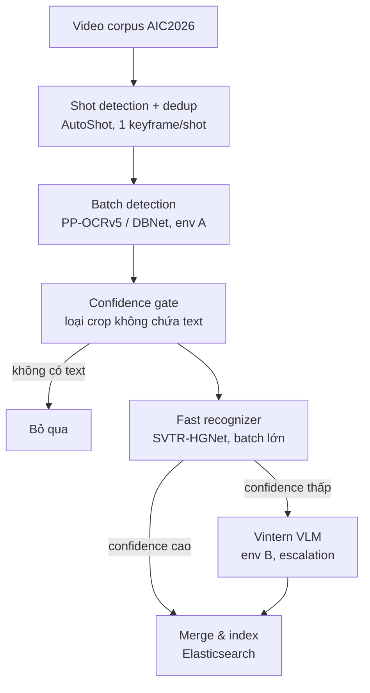

# Kiến trúc OCR Pipeline cho MMRS-LMF — Offline Extraction

## 1. Bối cảnh và mục tiêu

OCR text extraction trong MMRS-LMF chạy hoàn toàn ở **phase offline** (indexing), không phải real-time inference. Điều này thay đổi hoàn toàn trục tối ưu: thay vì tối ưu latency per-frame (như các paper scene text detection thường benchmark bằng FPS), mục tiêu chính là **tối thiểu hóa tổng thời gian xử lý toàn bộ corpus video AIC2026** trong khi vẫn giữ độ chính xác (recall/precision) đủ cao cho text signal phục vụ retrieval.

Điểm xuất phát của thiết kế: pipeline cũ dùng PP-DocLayoutV3 (document layout model) cho detection bị domain mismatch nghiêm trọng khi áp vào scene text từ video broadcast (banner tin tức, lower-third, watermark kênh) — vì PP-DocLayoutV3 được train để phân tích cấu trúc document scan, không phải để phát hiện text instance bất kỳ hình dạng/orientation trong ảnh tự nhiên.

## 2. Tổng quan pipeline

6 stage chính + 1 nhánh escalation. Toàn bộ pipeline chạy theo kiểu **batch-per-stage trên toàn corpus**, không phải per-frame end-to-end, để tận dụng đúng đặc điểm offline.

## 3. Chi tiết từng stage

### Stage 0 — Video corpus
Input là toàn bộ video AIC2026, chưa qua xử lý gì.

### Stage 1 — Shot detection + dedup

- Model: **AutoShot** (shot boundary detection, đã review trong literature như drop-in improvement so với TransNetV2).
- Mục đích: lấy đúng 1 keyframe đại diện mỗi shot, thay vì sample theo FPS cố định.
- Lý do: trong cùng một shot, banner/lower-third/watermark thường giữ nguyên nội dung text suốt cả đoạn. Chạy OCR trên mọi frame là trả tiền compute nhiều lần cho cùng một thông tin.
- Hiệu quả kỳ vọng: giảm volume cần xử lý OCR khoảng 10-30x tùy độ dài shot trung bình của corpus, không mất thông tin text vì nội dung lặp lại trong shot.

### Stage 2 — Batch detection (PP-OCRv5 / DBNet)

- Thay thế PP-DocLayoutV3 bằng detector dòng DBNet — vốn được train để phát hiện text instance bất kỳ hình dạng/orientation trong ảnh tự nhiên, đúng bản chất scene text hơn document-layout model.
- Cụ thể: PP-OCRv5 detector — backbone PP-HGNetV2 (nâng cấp từ PP-HGNet), detection head dùng PFHead (Parallel Fusion Head) + DSR (Dynamic Scale-aware Refinement), distillation từ visual encoder của GOT-OCR2.0 làm teacher để tăng robustness.
- Cần fine-tune lại trên VinText + scene text thực tế thu từ video AIC (PP-OCRv5 không có tiếng Việt trong list ngôn ngữ chính thức — chỉ Simplified/Traditional Chinese, Pinyin, English, Japanese).
- Output: **chỉ bounding box/polygon + confidence score**, KHÔNG có nội dung text. Detection là segmentation-based (dự đoán probability map → binarize → fit polygon), không có classification head để decode ký tự.
- Chạy trong môi trường riêng (env A — chỉ cần `paddleocr`, không bị ràng buộc bởi `transformers` version conflict).
- Batch hóa toàn bộ keyframe của corpus trong 1 pass.

### Stage 3 — Confidence gate

- Dùng trực tiếp probability map output của detector (đã có sẵn từ Stage 2, không cần model phụ) để loại sớm crop/frame có response quá yếu — tức không chứa text.
- Mục đích: tránh tốn compute ở cả 2 tier của Stage 4 cho những frame rõ ràng không có text.

### Stage 4 — Cascade recognition

**4a. Fast recognizer (toàn bộ crop còn lại)**
- Model: SVTR-HGNet (dual-branch recognition của PP-OCRv5 — nhánh GTC-NRTR attention-based đóng vai teacher, nhánh SVTR-HGNet CTC-based nhẹ dùng lúc inference).
- Batch size lớn vì model nhẹ, chạy được hàng nghìn crop/batch trên GPU.
- Lấy confidence trực tiếp từ CTC decode probability.

**4b. Vintern VLM (chỉ crop confidence thấp, ước tính ~10-20% tổng crop)**
- Escalation cho các case khó: dấu thanh mờ, chữ bị che, font lạ — nơi Vintern (VLM 1B param, world-knowledge mạnh) xử lý tốt hơn recognizer CTC nhẹ.
- Chạy trong môi trường riêng (env B — `transformers==4.37.2`).
- Vì chỉ áp dụng cho thiểu số crop, tiết kiệm 80-90% compute recognition so với chạy Vintern trên toàn bộ crop.

### Stage 5 — Merge & index

- Gộp kết quả từ cả 2 tier (đánh dấu nguồn: fast/vintern), ghi vào Elasticsearch kèm metadata (shot_id, timestamp, bbox, confidence).

## 4. Chiến lược tách môi trường (giải quyết transformers version conflict)

Vintern yêu cầu `transformers==4.37.2`, xung đột với các model khác trong hệ thống. Với workload offline, giải pháp tự nhiên là **không** load nhiều model trong cùng 1 process:

1. **Pass A** — chạy Stage 1-3 (detection) cho toàn bộ corpus trong env A, dump toàn bộ crop + metadata ra disk (Parquet/JSON).
2. Switch sang env B.
3. **Pass B** — chạy Stage 4 (recognition cascade) trên toàn bộ crop đã dump.

Lợi ích:
- Tránh overhead context-switch environment theo từng frame.
- Maximize GPU utilization riêng cho từng stage (detector nhẹ batch cực lớn; Vintern batch theo VRAM limit riêng).
- Cho phép checkpoint/resume theo video hoặc shot — quan trọng vì Colab free-tier giới hạn session, không cần chạy lại từ đầu khi bị disconnect.

## 5. Checklist tối ưu throughput

- Confidence gate dùng probability map có sẵn, không thêm model phụ.
- Batch size SVTR-HGNet đẩy cao (model nhẹ); batch Vintern giới hạn theo VRAM, cần group crop theo aspect ratio gần giống nhau trước khi pad batch để tránh lãng phí padding.
- Checkpoint theo video/shot, không theo frame, để dễ track tiến độ và resume.
- Threshold confidence ở Stage 3 và ngưỡng escalation ở Stage 4 cần tune thực nghiệm trên sample của corpus AIC (không có giá trị chuẩn sẵn vì phụ thuộc chất lượng video).

## 6. So sánh với các hướng kiến trúc đã khảo sát

| Hướng | Detection | Recognition | Đặc điểm | Quyết định |
|---|---|---|---|---|
| Pipeline tham khảo gốc | ResNet50 + DB++ | PP-OCRv3 + SVTR (fine-tune VinText) | 2-stage, baseline PaddleOCR cũ (2022) | Không dùng — đã có bản nâng cấp |
| PP-OCRv5 | PP-HGNetV2 + PFHead/DSR | GTC-NRTR + SVTR-HGNet (dual-branch, distillation) | 2-stage, nâng cấp trực tiếp | **Dùng cho Stage 2 & 4a** |
| VietTextSpotter | ResNet50 + Transformer + MFCAM/MSCAM | Transformer decoder (joint, set-prediction) | End-to-end single-network, H-mean 73.8% trên VinText | Không adopt toàn bộ — chi phí training nặng (pretrain 240K iter + finetune 260K iter), thiếu pretrained weight rộng, chưa rõ recognition decoder mạnh hơn Vintern; có thể mượn ý tưởng MFCAM (frequency-domain decoupling cho dấu thanh) như module bổ trợ nhẹ nếu sau fine-tune vẫn mất dấu nhiều |
| Pipeline đề xuất (MMRS-LMF) | PP-OCRv5/DBNet (fine-tune VinText + scene text AIC) | Cascade: SVTR-HGNet → Vintern (escalation) | 2-stage, batch-per-stage, offline-optimized | **Áp dụng** |

## 7. Vấn đề mở / hướng tiếp theo

- Cần tự thu thập và annotate scene text thực tế từ frame video AIC (không chỉ VinText) để fine-tune detector — VinText là ảnh biển hiệu/banner tĩnh, domain gap với video broadcast vẫn tồn tại.
- Benchmark thực tế tỷ lệ escalation lên Vintern trên sample corpus để xác nhận giả định ~10-20%, điều chỉnh ngưỡng confidence cho phù hợp.
- Nếu sau fine-tune detector vẫn còn hiện tượng mất dấu thanh (dấu nhỏ bị downsample mất), xem xét tích hợp ý tưởng MFCAM (2D-DCT frequency decoupling) như module nhẹ chèn vào feature map nông của detector, không cần rebuild toàn bộ thành kiến trúc end-to-end.
- Đánh giá lại ngưỡng threshold của confidence gate (Stage 3) định kỳ khi domain video corpus thay đổi (theo từng batch video mới của AIC2026).
