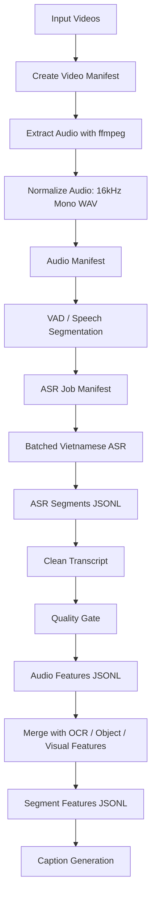

# Plan Pipeline Extract Audio cho Video Retrieval Captioning

## 1. Mục tiêu

Pipeline này dùng để extract audio từ video và tạo **audio feature có timestamp**. Output của audio pipeline không phải caption cuối cùng, mà là dữ liệu trung gian để merge với các feature khác như:

- OCR text
- Object tags
- Visual caption
- Scene / shot segment
- Metadata video

Sau khi merge, module caption generation sẽ sử dụng các feature này để viết caption cho từng đoạn video phục vụ bài toán **Video Retrieval**.

---

## 2. Tư duy thiết kế

Không thiết kế theo hướng:

```text
video.mp4 → audio.wav → transcript.txt
```

Mà thiết kế theo hướng:

```text
video.mp4
→ normalized audio
→ speech segments có timestamp
→ ASR transcript có timestamp
→ clean audio feature
→ merge với OCR/Object/Visual
→ caption generation
```

Vì tổng dữ liệu có thể lên tới hơn **300 giờ video**, pipeline cần tối ưu cho:

- Batch inference
- Resume khi lỗi
- Không lưu quá nhiều file chunk nhỏ
- Dễ debug chất lượng ASR
- Dễ align với frame/keyframe/shot
- Dễ đưa vào Elasticsearch hoặc vector database sau này

---

## 3. Pipeline tổng thể



---

## 4. Cấu trúc thư mục đề xuất

```text
outputs/
├── audio/
│   ├── wav/
│   │   ├── L21_V001.wav
│   │   └── L21_V002.wav
│   │
│   ├── manifests/
│   │   ├── video_manifest.jsonl
│   │   ├── audio_manifest.jsonl
│   │   └── asr_job_manifest.jsonl
│   │
│   ├── asr/
│   │   ├── asr_segments.jsonl
│   │   ├── asr_failed.jsonl
│   │   └── asr_quality_report.jsonl
│   │
│   └── features/
│       └── audio_features.jsonl
│
└── merged/
    └── segment_features.jsonl
```

File quan trọng nhất của audio pipeline là:

```text
outputs/audio/features/audio_features.jsonl
```

Đây là file sẽ được dùng để merge với OCR, object tags và visual caption.

---

## 5. Stage 1 — Tạo Video Manifest

### Mục tiêu

Tạo danh sách toàn bộ video cần xử lý, giúp pipeline có thể chạy theo batch và resume khi lỗi.

### File output

```text
outputs/audio/manifests/video_manifest.jsonl
```

### Schema

```json
{
  "video_id": "L21_V001",
  "video_path": "data/videos/L21_V001.mp4",
  "duration_sec": 602.48,
  "fps": 25,
  "status": "pending"
}
```

### Vai trò

- Quản lý video đầu vào
- Biết video nào đã xử lý
- Hỗ trợ resume
- Hỗ trợ chia batch khi xử lý nhiều video

---

## 6. Stage 2 — Extract và Normalize Audio

### Mục tiêu

Tách audio từ video và chuẩn hóa về format phù hợp cho ASR.

### Config đề xuất

```yaml
audio_extraction:
  sample_rate: 16000
  channels: 1
  codec: pcm_s16le
  format: wav
  keep_full_audio: true
  keep_chunk_audio: false
```

### Lệnh ffmpeg

```bash
ffmpeg -i input.mp4 -vn -ac 1 -ar 16000 -acodec pcm_s16le output.wav
```

### Output

```text
outputs/audio/wav/L21_V001.wav
```

### Audio Manifest

File:

```text
outputs/audio/manifests/audio_manifest.jsonl
```

Schema:

```json
{
  "video_id": "L21_V001",
  "audio_path": "outputs/audio/wav/L21_V001.wav",
  "duration_sec": 602.48,
  "sample_rate": 16000,
  "channels": 1,
  "format": "wav",
  "has_audio": true,
  "extract_status": "success"
}
```

### Lưu ý tối ưu tài nguyên

Không nên lưu tất cả audio chunk nhỏ vĩnh viễn. Với hơn 300 giờ video, số lượng chunk có thể rất lớn, gây tốn disk và chậm I/O. Chỉ nên lưu full audio `.wav`, còn chunk có thể được cắt tạm trong RAM hoặc thư mục temp khi inference.

---

## 7. Stage 3 — VAD / Speech Segmentation

### Mục tiêu

Tìm các đoạn có speech để ASR không phải xử lý toàn bộ audio một cách mù quáng.

### Config đề xuất

```yaml
vad:
  enabled: true
  method: silero_vad
  min_speech_duration_ms: 250
  min_silence_duration_ms: 700
  speech_pad_ms: 300
  max_speech_duration_sec: 30
```

### Output

File:

```text
outputs/audio/manifests/asr_job_manifest.jsonl
```

Schema:

```json
{
  "job_id": "asrjob_L21_V001_000001",
  "video_id": "L21_V001",
  "audio_path": "outputs/audio/wav/L21_V001.wav",
  "start_sec": 12.4,
  "end_sec": 28.9,
  "duration_sec": 16.5,
  "segment_type": "speech",
  "priority": 1,
  "status": "pending"
}
```

### Nguyên tắc quan trọng

Không cần tạo file:

```text
chunks/audseg_000001.wav
chunks/audseg_000002.wav
...
```

Thay vào đó, ASR job chỉ cần biết:

```text
audio_path + start_sec + end_sec
```

Worker sẽ tự đọc đoạn audio tương ứng khi inference.

---

## 8. Stage 4 — ASR tiếng Việt

### Mục tiêu

Tạo transcript tiếng Việt có timestamp theo audio segment.

### Backend/model gợi ý

Có thể benchmark các lựa chọn sau:

- `PhoWhisper-small`
- `PhoWhisper-medium`
- `PhoWhisper-large`
- `whisper-large-v3-turbo`
- `faster-whisper` backend
- `WhisperX` nếu cần word-level timestamp hoặc diarization

### Config ban đầu đề xuất

```yaml
asr:
  enabled: true
  language: vi
  backend: faster-whisper
  model: PhoWhisper-medium
  device: cuda
  compute_type: float16
  batch_size: 8
  beam_size: 1
  word_timestamps: false
  condition_on_previous_text: false
  vad_filter: false
```

### Giải thích config

| Config | Lý do |
|---|---|
| `language: vi` | Ép model xử lý tiếng Việt |
| `beam_size: 1` | Nhanh, phù hợp fast pass |
| `batch_size: 8` | Bắt đầu an toàn, sau đó tăng nếu GPU còn dư |
| `word_timestamps: false` | Chưa cần cho caption segment-level |
| `condition_on_previous_text: false` | Giảm lan truyền lỗi giữa các chunk |
| `vad_filter: false` | Vì đã có VAD riêng ở stage trước |

### Output

File:

```text
outputs/audio/asr/asr_segments.jsonl
```

Schema:

```json
{
  "asr_segment_id": "audseg_L21_V001_000001",
  "job_id": "asrjob_L21_V001_000001",
  "video_id": "L21_V001",

  "start_sec": 12.4,
  "end_sec": 28.9,
  "duration_sec": 16.5,

  "raw_text": "Đội tuyển Việt Nam đang tổ chức phản công rất nhanh ở cánh phải.",
  "language": "vi",

  "asr_info": {
    "model": "PhoWhisper-medium",
    "backend": "faster-whisper",
    "device": "cuda",
    "compute_type": "float16",
    "beam_size": 1,
    "batch_size": 8
  },

  "runtime": {
    "inference_time_sec": 0.82,
    "rtf": 0.049
  },

  "status": "success"
}
```

### Runtime field

`rtf` là real-time factor:

```text
rtf = inference_time_sec / audio_duration_sec
```

Ví dụ:

```text
rtf = 0.05 nghĩa là tốc độ khoảng 20x realtime
rtf = 0.02 nghĩa là tốc độ khoảng 50x realtime
```

Với hơn 300 giờ video, field này rất quan trọng để ước lượng tổng thời gian xử lý.

---

## 9. Stage 5 — Clean Transcript

### Mục tiêu

Chuẩn hóa transcript để dễ đưa vào caption và retrieval.

### Các bước xử lý

```text
1. Loại bỏ transcript rỗng
2. Normalize khoảng trắng
3. Sửa lỗi lặp đơn giản
4. Chuẩn hóa viết hoa đầu câu nhẹ
5. Thêm dấu câu cơ bản nếu cần
6. Không rewrite mạnh bằng LLM ở stage này
```

### Ví dụ

Raw ASR:

```text
đội tuyển việt nam đang tổ chức phản công rất nhanh ở cánh phải
```

Clean transcript:

```text
Đội tuyển Việt Nam đang tổ chức phản công rất nhanh ở cánh phải.
```

### Lưu ý

Không nên để LLM rewrite quá mạnh ở stage này vì có thể làm sai nội dung lời nói. Audio pipeline chỉ nên clean nhẹ, còn diễn giải tự nhiên hơn sẽ nằm ở caption generation.

---

## 10. Stage 6 — Quality Gate

### Mục tiêu

Đánh giá transcript có đủ tốt để dùng cho caption hay không.

### Config đề xuất

```yaml
quality_gate:
  enabled: true
  min_text_length: 5
  max_repetition_ratio: 0.35
  min_duration_sec: 0.5
  fallback_enabled: true
  fallback_only_low_quality: true
```

### Output

File:

```text
outputs/audio/asr/asr_quality_report.jsonl
```

Schema:

```json
{
  "asr_segment_id": "audseg_L21_V001_000001",
  "video_id": "L21_V001",
  "start_sec": 12.4,
  "end_sec": 28.9,

  "quality": {
    "has_text": true,
    "text_length": 63,
    "is_repeated": false,
    "is_too_short": false,
    "usable_for_caption": true,
    "need_fallback": false,
    "quality_level": "good"
  }
}
```

### Quality levels

```text
good     : dùng trực tiếp cho caption
medium   : dùng được nhưng không nên quá tin
bad      : không dùng hoặc cần fallback
empty    : không có speech/text
```

---

## 11. Stage 7 — Audio Feature Builder

### Mục tiêu

Biến output ASR thành audio feature gọn, sạch, phù hợp để merge với các feature khác.

### File output chính

```text
outputs/audio/features/audio_features.jsonl
```

### Schema đầy đủ

```json
{
  "feature_id": "audfeat_L21_V001_000001",
  "modality": "audio",
  "video_id": "L21_V001",

  "time": {
    "start_sec": 12.4,
    "end_sec": 28.9,
    "duration_sec": 16.5
  },

  "content": {
    "raw_transcript": "Đội tuyển Việt Nam đang tổ chức phản công rất nhanh ở cánh phải.",
    "clean_transcript": "Đội tuyển Việt Nam đang tổ chức phản công rất nhanh ở cánh phải.",
    "short_summary": "Bình luận viên mô tả đội tuyển Việt Nam phản công ở cánh phải.",
    "keywords": [
      "đội tuyển Việt Nam",
      "phản công",
      "cánh phải"
    ]
  },

  "caption_usage": {
    "usable_for_caption": true,
    "importance": "medium",
    "evidence_type": "speech",
    "caption_hint": "Có thể dùng làm ngữ cảnh lời bình/thuyết minh cho đoạn hình ảnh cùng thời điểm."
  },

  "quality": {
    "quality_level": "good",
    "need_fallback": false,
    "is_noisy": null,
    "confidence": null
  },

  "source": {
    "asr_segment_id": "audseg_L21_V001_000001",
    "asr_model": "PhoWhisper-medium",
    "backend": "faster-whisper"
  }
}
```

---

## 12. Schema tối giản nên dùng ngay

Nếu muốn triển khai nhanh, chỉ cần dùng schema sau:

```json
{
  "feature_id": "audfeat_L21_V001_000001",
  "modality": "audio",
  "video_id": "L21_V001",
  "start_sec": 12.4,
  "end_sec": 28.9,
  "clean_transcript": "Đội tuyển Việt Nam đang tổ chức phản công rất nhanh ở cánh phải.",
  "summary": "Bình luận viên mô tả đội tuyển Việt Nam phản công ở cánh phải.",
  "keywords": ["đội tuyển Việt Nam", "phản công", "cánh phải"],
  "usable_for_caption": true,
  "quality_level": "good",
  "source_model": "PhoWhisper-medium"
}
```

Đây là schema đủ tốt để merge với các feature khác.

---

## 13. Vì sao audio feature schema này phù hợp để merge?

Audio feature cần có 5 nhóm thông tin chính.

### 13.1. Định danh

```json
{
  "feature_id": "audfeat_L21_V001_000001",
  "modality": "audio",
  "video_id": "L21_V001"
}
```

Dùng để xác định feature thuộc video nào và modality nào.

### 13.2. Timestamp

```json
{
  "start_sec": 12.4,
  "end_sec": 28.9
}
```

Dùng để align với:

- Frame timestamp
- Keyframe timestamp
- Shot start/end
- OCR timestamp
- Object detection timestamp
- Visual caption timestamp

### 13.3. Nội dung audio

```json
{
  "clean_transcript": "...",
  "summary": "...",
  "keywords": ["..."]
}
```

Dùng làm input cho caption generation và retrieval.

### 13.4. Caption usage

```json
{
  "usable_for_caption": true,
  "quality_level": "good"
}
```

Giúp caption module biết có nên dùng audio hay không.

### 13.5. Source/debug

```json
{
  "source_model": "PhoWhisper-medium"
}
```

Giúp debug khi ASR sai hoặc cần chạy fallback.

---

## 14. Merge audio với các feature khác

Sau khi có `audio_features.jsonl`, không nên caption từng audio segment độc lập. Nên merge về cấp **video segment** hoặc **shot**.

File output sau khi merge:

```text
outputs/merged/segment_features.jsonl
```

Schema đề xuất:

```json
{
  "video_id": "L21_V001",
  "segment_id": "seg_L21_V001_000012",

  "time": {
    "start_sec": 12.0,
    "end_sec": 30.0,
    "duration_sec": 18.0
  },

  "frames": [
    {
      "frame_id": "frame_L21_V001_000360",
      "timestamp_sec": 14.4,
      "image_path": "outputs/frames/L21_V001/frame_000360.jpg"
    }
  ],

  "features": {
    "ocr": {
      "texts": [
        "VIỆT NAM",
        "TRỰC TIẾP"
      ]
    },

    "objects": {
      "tags": [
        "football player",
        "stadium",
        "crowd"
      ]
    },

    "visual": {
      "caption": "Một trận bóng đá đang diễn ra trên sân vận động."
    },

    "audio": {
      "feature_ids": [
        "audfeat_L21_V001_000001"
      ],
      "transcripts": [
        "Đội tuyển Việt Nam đang tổ chức phản công rất nhanh ở cánh phải."
      ],
      "summaries": [
        "Bình luận viên mô tả đội tuyển Việt Nam phản công ở cánh phải."
      ],
      "keywords": [
        "đội tuyển Việt Nam",
        "phản công",
        "cánh phải"
      ],
      "quality_level": "good"
    }
  }
}
```

---

## 15. Merge policy theo timestamp

### Config đề xuất

```yaml
merge_policy:
  target_level: video_segment
  match_by_time_overlap: true
  overlap_threshold_sec: 0.5
  include_nearest_audio_if_no_overlap: true
  nearest_audio_window_sec: 3.0
  do_not_duplicate_audio_per_frame: true
```

### Logic merge

Một audio feature được gắn với video segment nếu:

```text
audio_start < segment_end
AND
audio_end > segment_start
```

Tức là hai khoảng thời gian có overlap.

Nếu không có overlap nhưng audio gần segment, có thể lấy audio gần nhất trong cửa sổ:

```text
nearest_audio_window_sec = 3.0
```

### Nguyên tắc quan trọng

Không duplicate transcript vào từng frame. Chỉ nên gắn audio feature với segment hoặc shot, sau đó caption module đọc theo reference.

---

## 16. Caption prompt sau khi merge

Sau khi có `segment_features.jsonl`, caption generation có thể dùng prompt như sau:

```text
Bạn là hệ thống mô tả nội dung video cho video retrieval.

Hãy viết caption tiếng Việt ngắn gọn, trung thực, dễ tìm kiếm.

Thông tin hình ảnh:
- Visual caption: Một trận bóng đá đang diễn ra trên sân vận động.
- Objects: football player, stadium, crowd
- OCR: VIỆT NAM, TRỰC TIẾP

Thông tin audio:
- Transcript: Đội tuyển Việt Nam đang tổ chức phản công rất nhanh ở cánh phải.
- Summary: Bình luận viên mô tả đội tuyển Việt Nam phản công ở cánh phải.
- Keywords: đội tuyển Việt Nam, phản công, cánh phải

Yêu cầu:
- Ưu tiên thông tin xuất hiện ở nhiều nguồn.
- Không bịa tên người/địa điểm nếu không có bằng chứng.
- Caption 1 câu, dưới 40 từ.
```

Caption output kỳ vọng:

```text
Một trận bóng đá của đội tuyển Việt Nam đang được phát sóng trực tiếp, trong đó bình luận viên mô tả tình huống phản công ở cánh phải.
```

---

## 17. Config tổng hợp

Có thể lưu thành:

```text
configs/audio_pipeline.yaml
```

Nội dung:

```yaml
pipeline:
  name: audio_feature_extraction_for_video_retrieval
  version: 1.0
  output_level: segment
  output_format: jsonl

paths:
  video_manifest: outputs/audio/manifests/video_manifest.jsonl
  audio_manifest: outputs/audio/manifests/audio_manifest.jsonl
  asr_job_manifest: outputs/audio/manifests/asr_job_manifest.jsonl
  wav_dir: outputs/audio/wav
  asr_segments: outputs/audio/asr/asr_segments.jsonl
  asr_failed: outputs/audio/asr/asr_failed.jsonl
  asr_quality_report: outputs/audio/asr/asr_quality_report.jsonl
  audio_features: outputs/audio/features/audio_features.jsonl

audio_extraction:
  enabled: true
  sample_rate: 16000
  channels: 1
  codec: pcm_s16le
  format: wav
  keep_full_audio: true
  keep_chunk_audio: false

vad:
  enabled: true
  method: silero_vad
  min_speech_duration_ms: 250
  min_silence_duration_ms: 700
  speech_pad_ms: 300
  max_speech_duration_sec: 30

asr:
  enabled: true
  language: vi
  backend: faster-whisper
  model: PhoWhisper-medium
  device: cuda
  compute_type: float16
  batch_size: 8
  beam_size: 1
  word_timestamps: false
  condition_on_previous_text: false

text_cleaning:
  normalize_whitespace: true
  remove_empty_text: true
  fix_simple_repetition: true
  add_basic_punctuation: true
  aggressive_rewrite: false

quality_gate:
  enabled: true
  min_text_length: 5
  max_repetition_ratio: 0.35
  fallback_enabled: true
  fallback_only_low_quality: true
  quality_levels:
    - good
    - medium
    - bad
    - empty

audio_feature_output:
  file: outputs/audio/features/audio_features.jsonl
  schema_version: 1.0
  include_raw_transcript: true
  include_clean_transcript: true
  include_short_summary: true
  include_keywords: true
  include_quality: true
  include_source: true
  include_runtime: false
  target_usage:
    - caption_generation
    - video_retrieval
    - feature_fusion

merge_policy:
  target_level: video_segment
  match_by_time_overlap: true
  overlap_threshold_sec: 0.5
  include_nearest_audio_if_no_overlap: true
  nearest_audio_window_sec: 3.0
  do_not_duplicate_audio_per_frame: true
```

---

## 18. Tối ưu inference cho hơn 300 giờ video

### 18.1. Không chạy model lớn cho toàn bộ ngay từ đầu

Nên chia thành 2 pass:

```text
Fast pass:
- model small/medium/turbo
- beam_size = 1
- batch_size = 8 hoặc 16
- word_timestamps = false

Fallback pass:
- chỉ chạy lại segment chất lượng thấp
- model lớn hơn hoặc beam_size cao hơn
```

### 18.2. Không bật word-level timestamp mặc định

Vì caption segment-level chỉ cần:

```text
start_sec
end_sec
clean_transcript
```

Word-level timestamp chỉ nên bật nếu cần subtitle hoặc highlight từng từ trong UI.

### 18.3. Không lưu chunk audio hàng loạt

Chỉ lưu chunk nếu:

```text
- ASR lỗi
- Quality thấp
- Cần debug thủ công
- Cần tạo sample đánh giá
```

### 18.4. Load model một lần

Không nên:

```python
for video in videos:
    model = load_model()
    transcribe(video)
```

Nên:

```python
model = load_model_once()
for batch in asr_batches:
    transcribe(batch)
```

### 18.5. Batch theo duration gần nhau

Nên group ASR jobs theo duration:

```text
0–5s
5–15s
15–30s
```

Việc này giúp giảm padding và tăng GPU utilization.

---

## 19. Thứ tự triển khai thực tế

### Phase 1 — Bản tối thiểu

```text
1. Tạo video_manifest.jsonl
2. Extract audio bằng ffmpeg
3. Tạo audio_manifest.jsonl
4. Chạy VAD tạo asr_job_manifest.jsonl
5. Chạy ASR tạo asr_segments.jsonl
6. Clean text
7. Tạo audio_features.jsonl
```

Kết quả cần đạt:

```text
Mỗi video có audio features theo timestamp.
Có thể lấy audio feature tương ứng với một đoạn video bất kỳ.
```

### Phase 2 — Batch inference

```text
1. Batch các ASR job theo duration
2. Load model một lần
3. Ghi JSONL theo từng batch
4. Thêm resume logic
5. Thêm asr_failed.jsonl
```

### Phase 3 — Quality fallback

```text
1. Chấm quality cho từng audio segment
2. Đánh dấu need_fallback
3. Chạy lại segment bad bằng model tốt hơn hoặc beam lớn hơn
4. Update audio_features.jsonl
```

### Phase 4 — Merge với multimodal features

```text
1. Load audio_features.jsonl
2. Load OCR features
3. Load object features
4. Load visual captions
5. Merge theo video_id + time overlap
6. Tạo segment_features.jsonl
7. Đưa segment_features vào caption generator
```

---

## 20. Output cuối cùng của audio pipeline

Audio pipeline nên dừng ở file:

```text
outputs/audio/features/audio_features.jsonl
```

Không nên để audio pipeline tự viết caption cuối cùng.

Caption cuối cùng nên thuộc module riêng:

```text
caption_generation/
```

Vì caption cần kết hợp nhiều nguồn:

```text
audio + OCR + object + visual + scene context
```

---

## 21. Kết luận

Pipeline audio nên được thiết kế như một **feature source có timestamp**, không phải transcript file đơn giản.

Pipeline đề xuất:

```text
Video
→ Extract normalized audio
→ VAD speech segment
→ ASR tiếng Việt
→ Clean transcript
→ Quality gate
→ audio_features.jsonl
→ merge với OCR/Object/Visual
→ caption generation
```

Schema cốt lõi cần giữ:

```text
video_id
start_sec
end_sec
clean_transcript
summary
keywords
usable_for_caption
quality_level
source_model
```

Chỉ cần giữ đúng các field này, audio feature có thể kết hợp với bất kỳ feature nào khác để tạo caption cho Video Retrieval mà không cần sửa lại toàn bộ pipeline.
