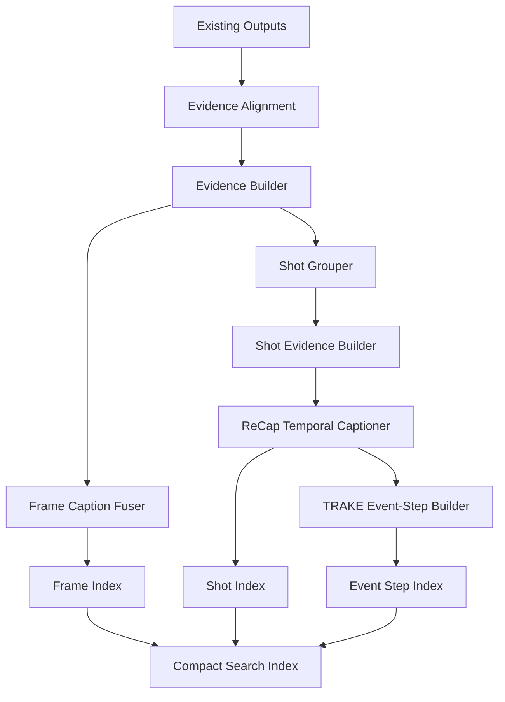

# Plan triển khai Caption Fusion cho Video Retrieval

**Mục tiêu:** thiết kế module caption tận dụng các output đã có gồm **OCR**, **object detection/counts**, **image tags**, và **audio/ASR**, theo hướng kết hợp **FuseCap-style evidence fusion** và **U-CESE/ReCap-style temporal captioning** để tối ưu tìm kiếm video, đặc biệt cho các truy vấn dạng **TRAKE / temporal alignment**.

---

## 1. Bối cảnh hiện tại

Pipeline hiện tại đã có các nguồn evidence độc lập:

```text
Keyframes / video frames
├── OCR output
├── Object detection output
│   ├── object tags
│   ├── object counts
│   ├── bboxes
│   └── confidence
├── Image-level tags
└── Audio / ASR transcript
```

Mục tiêu của caption module **không phải detect lại object** và **không phải thay OCR/audio**, mà là:

```text
OCR + object_counts + tags + audio
→ evidence builder
→ caption fuser
→ frame_caption + temporal_caption + search_tags + trake_text
```

---

## 2. Định hướng phương pháp

### 2.1. FuseCap-style evidence fusion

FuseCap gốc xử lý bài toán image captioning bằng cách fuse:

```text
original caption
+ object detector output
+ attribute recognizer output
+ OCR output
→ LLM fuser
→ enriched caption
```

Trong bài toán hiện tại, ta có thể học theo FuseCap ở tầng **frame-level fusion**:

```text
frame evidence
├── object_counts
├── tags
├── OCR
├── audio window
└── optional initial caption
→ fused frame caption
```

Vai trò chính:

- Làm caption frame giàu thông tin hơn.
- Giảm caption quá chung chung.
- Kết hợp object/OCR/audio thành một đoạn text dễ search.
- Tạo `frame_caption`, `search_tags`, `visible_actions`, `scene_type`.

### 2.2. U-CESE/ReCap-style temporal captioning

U-CESE/ReCap phù hợp hơn cho video retrieval vì caption không chỉ xét một frame độc lập, mà dùng memory theo thời gian:

```text
shot_t + evidence_t + memory_{t-1}
→ temporal_caption_t + memory_t
```

Vai trò chính:

- Giữ ngữ cảnh xuyên suốt video.
- Hỗ trợ search clip/shot thay vì chỉ search frame.
- Tốt hơn cho query có tính thứ tự thời gian.
- Tạo `temporal_caption`, `memory_before`, `memory_after`, `trake_text`.

### 2.3. Kết luận lựa chọn framework

Không chọn “FuseCap hoặc U-CESE” theo kiểu loại trừ. Thiết kế tối ưu là:

```text
FuseCap-style fusion ở frame-level
+
U-CESE/ReCap-style memory ở shot-level
+
TRAKE event-step output cho temporal alignment
```

---

## 3. Kiến trúc tổng thể



---

## 4. Đơn vị xử lý chính

### 4.1. Frame-level

Dùng cho mô tả trực tiếp từng keyframe.

```text
Input:
- frame_id
- timestamp_sec
- object_counts
- object_tags
- OCR text quanh frame
- audio window quanh timestamp
- optional initial caption

Output:
- frame_caption
- search_tags
- visible_actions
- scene_type
- frame_search_text
```

### 4.2. Shot-level

Dùng cho caption theo đoạn, có memory.

```text
Input:
- shot_id
- representative_frame_ids
- merged object_counts
- merged OCR
- merged audio transcript
- previous memory
- frame captions trong shot

Output:
- shot_caption
- temporal_caption
- memory_before
- memory_after
- shot_search_text
```

### 4.3. Event-step / TRAKE-level

Dùng cho truy vấn yêu cầu nhiều key moments theo thứ tự.

```text
Input:
- frame_caption
- temporal_caption
- prev/next shot context
- object/OCR/audio evidence

Output:
- event_id
- step_order
- action_state
- temporal_role
- before_context
- current_observation
- after_context
- trake_text
```

---

## 5. Cấu trúc thư mục đề xuất

```text
caption_pipeline/
├── configs/
│   ├── caption_fusion_a5000.yaml
│   ├── caption_fusion_colab.yaml
│   └── prompts/
│       ├── frame_caption_prompt.txt
│       ├── recap_caption_prompt.txt
│       └── trake_event_step_prompt.txt
│
├── inputs/
│   ├── ocr/
│   ├── object_detection/
│   ├── tags/
│   ├── audio_asr/
│   └── keyframes/
│
├── src/
│   ├── load_inputs.py
│   ├── evidence_alignment.py
│   ├── evidence_builder.py
│   ├── frame_caption_fuser.py
│   ├── shot_grouper.py
│   ├── recap_captioner.py
│   ├── trake_event_builder.py
│   ├── search_text_builder.py
│   ├── schema.py
│   └── utils.py
│
├── outputs/
│   ├── evidence/
│   │   ├── frame_evidence.jsonl
│   │   └── shot_evidence.jsonl
│   ├── captions/
│   │   ├── frame_index.jsonl
│   │   ├── shot_index.jsonl
│   │   ├── event_step_index.jsonl
│   │   └── compact_search_index.jsonl
│   ├── logs/
│   └── reports/
│       ├── caption_quality_report.md
│       └── retrieval_eval_report.md
│
└── run_caption_pipeline.py
```

---

## 6. Input schema chuẩn hóa

### 6.1. OCR input

```json
{
  "video_id": "L22_V012",
  "frame_id": "L22_V012_000321",
  "timestamp_sec": 128.4,
  "ocr_lines": [
    {
      "text": "HỘI NGHỊ CHUYỂN ĐỔI SỐ",
      "confidence": 0.91,
      "bbox_xyxy": [120, 40, 640, 90]
    }
  ],
  "ocr_text_joined": "HỘI NGHỊ CHUYỂN ĐỔI SỐ"
}
```

### 6.2. Object detection input

```json
{
  "video_id": "L22_V012",
  "frame_id": "L22_V012_000321",
  "timestamp_sec": 128.4,
  "object_tags": ["person", "screen", "microphone"],
  "object_counts": {
    "person": 2,
    "screen": 1,
    "microphone": 1
  },
  "objects": [
    {
      "label": "person",
      "confidence": 0.91,
      "bbox_xyxy": [120, 80, 340, 620],
      "area_ratio": 0.23,
      "position": "center"
    }
  ]
}
```

### 6.3. Image tags input

```json
{
  "video_id": "L22_V012",
  "frame_id": "L22_V012_000321",
  "tags": ["conference", "presentation", "indoor", "person"]
}
```

### 6.4. Audio / ASR input

```json
{
  "video_id": "L22_V012",
  "segments": [
    {
      "start_sec": 123.0,
      "end_sec": 133.0,
      "text": "hôm nay chúng ta thảo luận về chuyển đổi số trong quản lý",
      "confidence": 0.84
    }
  ]
}
```

---

## 7. Evidence Alignment

### 7.1. Mục tiêu

Ghép mọi nguồn evidence theo:

```text
video_id + frame_id + timestamp_sec
```

Audio không gắn trực tiếp theo frame, nên cần lấy theo time window.

### 7.2. Audio window

Config đề xuất:

```yaml
audio_alignment:
  frame_window_sec_before: 5
  frame_window_sec_after: 5
  shot_use_full_segment: true
  max_audio_chars_frame: 700
  max_audio_chars_shot: 1500
```

Ví dụ:

```text
frame timestamp = 128.4s
window = [123.4s, 133.4s]
```

### 7.3. Output frame evidence

```json
{
  "video_id": "L22_V012",
  "frame_id": "L22_V012_000321",
  "timestamp_sec": 128.4,
  "shot_id": null,
  "object_counts": {
    "person": 2,
    "screen": 1,
    "microphone": 1
  },
  "object_tags": ["person", "screen", "microphone"],
  "image_tags": ["conference", "presentation", "indoor"],
  "ocr_text": ["HỘI NGHỊ CHUYỂN ĐỔI SỐ"],
  "audio_window_text": "hôm nay chúng ta thảo luận về chuyển đổi số trong quản lý"
}
```

---

## 8. Evidence Builder

### 8.1. Mục tiêu

Làm sạch và nén evidence trước khi đưa vào caption model.

### 8.2. Rules đề xuất

```yaml
evidence_builder:
  max_objects: 10
  max_tags: 15
  max_ocr_lines: 8
  min_ocr_confidence: 0.35
  min_object_confidence: 0.30
  min_area_ratio: 0.0005
  max_audio_chars: 700

  drop_object_labels:
    - "background"
    - "sky"
    - "outdoor"
    - "indoor"

  keep_scene_tags: true
  keep_object_positions: true
  normalize_vietnamese_text: true
```

### 8.3. Evidence packing format

```json
{
  "visual_evidence": {
    "main_objects": {
      "person": 2,
      "screen": 1,
      "microphone": 1
    },
    "image_tags": ["conference", "presentation", "indoor"],
    "important_objects": [
      "2 persons",
      "1 screen",
      "1 microphone"
    ]
  },
  "ocr_evidence": {
    "texts": ["HỘI NGHỊ CHUYỂN ĐỔI SỐ"],
    "important_text": "HỘI NGHỊ CHUYỂN ĐỔI SỐ"
  },
  "audio_evidence": {
    "transcript": "hôm nay chúng ta thảo luận về chuyển đổi số trong quản lý",
    "time_window": [123.4, 133.4]
  }
}
```

---

## 9. Caption model strategy

### 9.1. Baseline 1 — Text-only fuser

Không đưa ảnh vào model, chỉ dùng evidence đã extract.

```text
object_counts + tags + OCR + audio
→ text LLM
→ frame_caption
```

Ưu điểm:

- Rẻ.
- Nhanh.
- Dễ scale cho nhiều giờ video.
- Phù hợp khi object/OCR/audio đã đủ tốt.

Nhược điểm:

- Không nhìn lại ảnh gốc.
- Không hiểu layout/hành động tinh tế nếu evidence thiếu.

### 9.2. Baseline 2 — FuseCap initial caption + text fuser

Dùng FuseCap/BLIP-style captioner để tạo caption gốc cho frame, sau đó fuse với evidence.

```text
frame image
→ initial_caption

initial_caption + object_counts + tags + OCR + audio
→ text fuser
→ final frame_caption
```

Vai trò:

- Tạo caption ảnh ban đầu nhanh.
- Giúp fuser có thêm mô tả thị giác tổng quát.
- Không đủ để xử lý temporal memory hoặc audio trực tiếp.

### 9.3. Baseline 3 — VLM fuser

Dùng VLM như Qwen2.5-VL / InternVL / Gemini để nhận thêm ảnh.

```text
frame image + object_counts + tags + OCR + audio
→ VLM fuser
→ frame_caption
```

Ưu điểm:

- Caption tự nhiên hơn.
- Có thể kiểm tra lại ảnh.
- Hiểu layout/hành động tốt hơn.

Nhược điểm:

- Chậm hơn.
- Tốn GPU/API hơn.
- Không nên chạy trên mọi frame nếu dữ liệu lớn.

### 9.4. Khuyến nghị triển khai

```text
Giai đoạn đầu:
Text-only fuser cho toàn bộ sample.

Giai đoạn hai:
Thêm FuseCap initial caption để benchmark.

Giai đoạn ba:
Dùng VLM fuser cho representative frames hoặc shot quan trọng.
```

---

## 10. Frame Caption Fuser

### 10.1. Input

```json
{
  "frame_id": "L22_V012_000321",
  "object_counts": {
    "person": 2,
    "screen": 1,
    "microphone": 1
  },
  "image_tags": ["conference", "presentation", "indoor"],
  "ocr_text": ["HỘI NGHỊ CHUYỂN ĐỔI SỐ"],
  "audio_window_text": "hôm nay chúng ta thảo luận về chuyển đổi số trong quản lý",
  "initial_caption": "A person is standing in front of a screen."
}
```

### 10.2. Prompt template

```text
Bạn là module tạo caption cho hệ thống video retrieval.

Nhiệm vụ:
Tạo caption tiếng Việt cho một keyframe dựa trên object detection, image tags, OCR và audio transcript.

Quy tắc:
- Chỉ sử dụng thông tin được cung cấp.
- Không đoán tên người, địa điểm, tổ chức nếu không xuất hiện trong OCR hoặc audio.
- Nếu thông tin không chắc chắn, diễn đạt thận trọng.
- Caption phải hữu ích cho tìm kiếm video.
- Trả về JSON hợp lệ.

Input:
Initial caption:
{initial_caption}

Object counts:
{object_counts}

Image tags:
{image_tags}

OCR text:
{ocr_text}

Audio transcript near this frame:
{audio_window_text}

Output JSON:
{
  "frame_caption": "...",
  "search_tags": ["..."],
  "scene_type": "...",
  "visible_actions": ["..."],
  "caption_confidence": "high|medium|low",
  "evidence_used": {
    "initial_caption": true,
    "objects": true,
    "tags": true,
    "ocr": true,
    "audio": true
  }
}
```

### 10.3. Output

```json
{
  "doc_type": "frame",
  "video_id": "L22_V012",
  "frame_id": "L22_V012_000321",
  "timestamp_sec": 128.4,
  "frame_caption": "Hai người xuất hiện trong bối cảnh hội nghị, phía sau có màn hình và microphone.",
  "search_tags": [
    "hội nghị",
    "chuyển đổi số",
    "người trình bày",
    "màn hình",
    "microphone"
  ],
  "scene_type": "conference_or_presentation",
  "visible_actions": ["standing", "presenting", "speaking"],
  "caption_confidence": "medium"
}
```

---

## 11. Shot Grouping

### 11.1. Mục tiêu

Gom các keyframes gần nhau thành shot/segment để giảm số lần caption và tăng tính ngữ cảnh.

### 11.2. Nguồn grouping

Có thể chọn một trong các cách:

```text
1. Dựa vào shot boundary đã có.
2. Dựa vào keyframe timestamp gap.
3. Dựa vào image similarity / embedding similarity.
4. Dựa vào DAKE-style scene change nếu muốn học theo U-CESE.
```

### 11.3. Config đề xuất

```yaml
shot_grouping:
  method: "timestamp_gap"
  max_gap_sec: 5.0
  max_shot_duration_sec: 20.0
  min_frames_per_shot: 1
  max_representative_frames: 3
  representative_strategy: "first_middle_last"
```

### 11.4. Shot evidence

```json
{
  "video_id": "L22_V012",
  "shot_id": "L22_V012_shot_0032",
  "start_sec": 120.0,
  "end_sec": 136.5,
  "representative_frame_ids": [
    "L22_V012_000318",
    "L22_V012_000321",
    "L22_V012_000329"
  ],
  "merged_object_counts": {
    "person": 3,
    "screen": 2,
    "microphone": 1
  },
  "merged_ocr_text": [
    "HỘI NGHỊ CHUYỂN ĐỔI SỐ",
    "TP. HỒ CHÍ MINH"
  ],
  "merged_audio_text": "hôm nay chúng ta thảo luận về chuyển đổi số trong quản lý và vận hành",
  "frame_captions": [
    "Một người đang đứng trước màn hình.",
    "Hai người xuất hiện trong bối cảnh hội nghị."
  ]
}
```

---

## 12. ReCap Temporal Captioner

### 12.1. Input

```text
shot evidence
+ memory_{t-1}
→ temporal caption
+ memory_t
```

### 12.2. Memory design

Memory không nên quá dài. Chỉ giữ thông tin hữu ích cho shot sau.

```yaml
recap_memory:
  max_memory_chars: 700
  memory_update_policy: "keep_topic_entities_scene_goal"
  reset_memory_when:
    scene_change_score_above: 0.85
    audio_topic_change: true
    max_silence_sec: 20
```

### 12.3. Prompt template

```text
Bạn là module ReCap caption cho video retrieval.

Nhiệm vụ:
Tạo caption cho shot hiện tại bằng cách sử dụng evidence hiện tại và memory từ shot trước.

Quy tắc:
- Chỉ dùng thông tin có trong evidence hoặc memory.
- Không thêm thông tin không có bằng chứng.
- Caption phải hữu ích cho tìm kiếm video.
- Memory mới phải ngắn, chỉ giữ thông tin còn hữu ích cho shot sau.
- Trả về JSON hợp lệ.

Previous memory:
{memory_before}

Current shot evidence:
Frame captions:
{frame_captions}

Object counts:
{merged_object_counts}

OCR:
{merged_ocr_text}

Audio:
{merged_audio_text}

Output JSON:
{
  "shot_caption": "...",
  "temporal_caption": "...",
  "updated_memory": "...",
  "search_tags": ["..."],
  "event_actions": ["..."],
  "temporal_role": "beginning|continuation|change|completion|unknown",
  "caption_confidence": "high|medium|low"
}
```

### 12.4. Output

```json
{
  "doc_type": "shot",
  "video_id": "L22_V012",
  "shot_id": "L22_V012_shot_0032",
  "start_sec": 120.0,
  "end_sec": 136.5,
  "shot_caption": "Đoạn video cho thấy một người đang trình bày trong bối cảnh hội nghị, có màn hình và microphone.",
  "temporal_caption": "Người trình bày tiếp tục nói về chủ đề chuyển đổi số trong một hội nghị, với màn hình và microphone xuất hiện xuyên suốt đoạn này.",
  "memory_before": "Video đang nói về một sự kiện hoặc hội nghị liên quan đến chuyển đổi số.",
  "memory_after": "Bối cảnh hiện tại vẫn là hội nghị chuyển đổi số; nhân vật chính đang trình bày trước màn hình.",
  "search_tags": [
    "hội nghị",
    "chuyển đổi số",
    "người trình bày",
    "màn hình",
    "microphone"
  ],
  "temporal_role": "continuation"
}
```

---

## 13. TRAKE / Event-Step Builder

### 13.1. Mục tiêu

Tạo metadata chuyên biệt cho query có nhiều bước theo thứ tự thời gian.

Ví dụ query:

```text
đầu tiên người phụ nữ cho nguyên liệu vào nồi, sau đó khuấy, cuối cùng múc ra đĩa
```

Cần search được:

```text
step_1 timestamp < step_2 timestamp < step_3 timestamp
```

### 13.2. Prompt template

```text
Bạn là module trích xuất event-step cho bài toán temporal video retrieval.

Nhiệm vụ:
Từ caption và evidence của frame/shot hiện tại, hãy tạo thông tin event-step phục vụ tìm kiếm theo thứ tự thời gian.

Quy tắc:
- Chỉ dùng evidence được cung cấp.
- Không đoán hành động nếu evidence không đủ.
- Nếu không thấy hành động rõ, đặt action_state = "unknown".
- Trả về JSON hợp lệ.

Input:
Frame caption:
{frame_caption}

Temporal caption:
{temporal_caption}

Previous context:
{previous_context}

Next context:
{next_context}

Objects:
{object_counts}

OCR:
{ocr_text}

Audio:
{audio_text}

Output JSON:
{
  "event_caption": "...",
  "action_state": "start|middle|end|transition|result|unknown",
  "temporal_role": "beginning|continuation|change|completion|unknown",
  "actors": ["..."],
  "actions": ["..."],
  "objects_involved": ["..."],
  "scene": "...",
  "before_context": "...",
  "current_observation": "...",
  "after_context": "...",
  "trake_text": "..."
}
```

### 13.3. Output

```json
{
  "doc_type": "event_step",
  "video_id": "L22_V012",
  "shot_id": "L22_V012_shot_0032",
  "frame_id": "L22_V012_000321",
  "timestamp_sec": 128.4,
  "event_id": "L22_V012_event_0007",
  "step_order": 2,
  "event_caption": "Người trình bày đang đứng trước màn hình và nói về chuyển đổi số.",
  "action_state": "middle",
  "temporal_role": "continuation",
  "before_context": "Trước đó, nội dung video giới thiệu bối cảnh hội nghị chuyển đổi số.",
  "current_observation": "Ở frame hiện tại, người trình bày đứng trước màn hình và cầm micro.",
  "after_context": "Sau đó đoạn video tiếp tục phần giải thích hoặc trình bày nội dung.",
  "actors": ["person"],
  "actions": ["standing", "speaking", "presenting"],
  "objects_involved": ["microphone", "screen", "banner"],
  "scene": "conference",
  "trake_text": "middle continuation người trình bày đứng trước màn hình cầm micro nói về chuyển đổi số"
}
```

---

## 14. Output indexes

### 14.1. `frame_index.jsonl`

Dùng cho frame-level retrieval.

```json
{
  "doc_type": "frame",
  "video_id": "L22_V012",
  "frame_id": "L22_V012_000321",
  "timestamp_sec": 128.4,
  "shot_id": "L22_V012_shot_0032",
  "frame_caption": "Hai người xuất hiện trong bối cảnh hội nghị, phía sau có màn hình và microphone.",
  "object_counts": {
    "person": 2,
    "screen": 1,
    "microphone": 1
  },
  "object_tags": ["person", "screen", "microphone"],
  "ocr_text_joined": "HỘI NGHỊ CHUYỂN ĐỔI SỐ",
  "audio_window_text": "hôm nay chúng ta thảo luận về chuyển đổi số trong quản lý",
  "search_tags": ["hội nghị", "chuyển đổi số", "người trình bày"],
  "frame_search_text": "Hai người xuất hiện trong bối cảnh hội nghị... HỘI NGHỊ CHUYỂN ĐỔI SỐ... person screen microphone..."
}
```

### 14.2. `shot_index.jsonl`

Dùng cho shot/clip-level retrieval.

```json
{
  "doc_type": "shot",
  "video_id": "L22_V012",
  "shot_id": "L22_V012_shot_0032",
  "start_sec": 120.0,
  "end_sec": 136.5,
  "representative_frame_ids": [
    "L22_V012_000318",
    "L22_V012_000321",
    "L22_V012_000329"
  ],
  "shot_caption": "Đoạn video cho thấy một người đang trình bày trong bối cảnh hội nghị.",
  "temporal_caption": "Người trình bày tiếp tục nói về chủ đề chuyển đổi số trong một hội nghị.",
  "memory_before": "Video đang nói về hội nghị chuyển đổi số.",
  "memory_after": "Bối cảnh hiện tại vẫn là hội nghị chuyển đổi số.",
  "shot_search_text": "Đoạn video cho thấy một người đang trình bày... chuyển đổi số..."
}
```

### 14.3. `event_step_index.jsonl`

Dùng cho TRAKE / temporal alignment.

```json
{
  "doc_type": "event_step",
  "video_id": "L22_V012",
  "shot_id": "L22_V012_shot_0032",
  "frame_id": "L22_V012_000321",
  "timestamp_sec": 128.4,
  "event_id": "L22_V012_event_0007",
  "step_order": 2,
  "action_state": "middle",
  "temporal_role": "continuation",
  "trake_text": "middle continuation người trình bày đứng trước màn hình cầm micro nói về chuyển đổi số"
}
```

### 14.4. `compact_search_index.jsonl`

Dùng cho search nhanh trong Elasticsearch.

```json
{
  "unit_type": "shot",
  "unit_id": "L22_V012_shot_0032",
  "video_id": "L22_V012",
  "start_sec": 120.0,
  "end_sec": 136.5,
  "caption_text": "Người trình bày tiếp tục nói về chủ đề chuyển đổi số trong một hội nghị.",
  "ocr_text": "HỘI NGHỊ CHUYỂN ĐỔI SỐ TP. HỒ CHÍ MINH",
  "audio_text": "thảo luận về chuyển đổi số trong quản lý và vận hành",
  "object_text": "person microphone screen banner",
  "trake_text": "middle continuation người trình bày đứng trước màn hình cầm micro nói về chuyển đổi số",
  "all_text": "Người trình bày tiếp tục nói về chủ đề chuyển đổi số... HỘI NGHỊ CHUYỂN ĐỔI SỐ... person microphone screen banner..."
}
```

---

## 15. Search optimization design

### 15.1. Field-specific search

Không chỉ lưu một field `caption`. Nên index nhiều field:

```text
frame_caption       → search visual mô tả frame
shot_caption        → search mô tả đoạn
telemporal_caption  → search ngữ cảnh video
ocr_text            → search text xuất hiện trên ảnh
audio_text          → search lời nói
object_text         → search/filter object
trake_text          → search query temporal/action order
all_text            → search nhanh tổng hợp
```

### 15.2. Suggested ES fields

```yaml
elasticsearch_mapping:
  text_fields:
    frame_caption: vietnamese_analyzer
    shot_caption: vietnamese_analyzer
    temporal_caption: vietnamese_analyzer
    ocr_text: vietnamese_analyzer
    audio_text: vietnamese_analyzer
    object_text: keyword_or_text
    trake_text: vietnamese_analyzer
    all_text: vietnamese_analyzer

  keyword_fields:
    video_id: keyword
    frame_id: keyword
    shot_id: keyword
    event_id: keyword
    object_tags: keyword
    search_tags: keyword

  numeric_fields:
    timestamp_sec: float
    start_sec: float
    end_sec: float
    step_order: integer
```

### 15.3. Query routing

```text
Query chứa text trong ảnh
→ ưu tiên OCR field

Query nói về lời thoại/chủ đề
→ ưu tiên audio_text + temporal_caption

Query nói về object cụ thể
→ ưu tiên object_text + frame_caption

Query nói về sự kiện/clip
→ ưu tiên shot_caption + temporal_caption

Query nhiều bước theo thứ tự
→ ưu tiên event_step_index + trake_text + timestamp constraints
```

---

## 16. TRAKE retrieval strategy

### 16.1. Query decomposition

Ví dụ query:

```text
đầu tiên người phụ nữ cho nguyên liệu vào nồi, sau đó khuấy, cuối cùng múc ra đĩa
```

Tách thành:

```json
[
  {
    "query_id": "q1",
    "text": "người phụ nữ cho nguyên liệu vào nồi",
    "expected_order": 1
  },
  {
    "query_id": "q2",
    "text": "người phụ nữ khuấy trong nồi",
    "expected_order": 2
  },
  {
    "query_id": "q3",
    "text": "người phụ nữ múc thức ăn ra đĩa",
    "expected_order": 3
  }
]
```

### 16.2. Retrieval

```text
q1 → retrieve top-K event_steps
q2 → retrieve top-K event_steps
q3 → retrieve top-K event_steps
```

### 16.3. Temporal reranking

Rerank theo:

```text
same video_id
timestamp_q1 < timestamp_q2 < timestamp_q3
clip duration không quá dài
score semantic cao
object/action overlap cao
event_id/shot_id gần nhau
```

### 16.4. Score đề xuất

```text
final_score =
  0.35 * semantic_score
+ 0.20 * lexical_score
+ 0.15 * object_action_score
+ 0.15 * temporal_order_score
+ 0.10 * clip_compactness_score
+ 0.05 * evidence_confidence
```

---

## 17. Config tổng hợp đề xuất

```yaml
caption_pipeline:
  version: "caption_fusecap_recap_trake_v1"

  input:
    ocr_path: "outputs/ocr/ocr.jsonl"
    object_path: "outputs/object_detection/objects.jsonl"
    tags_path: "outputs/tags/tags.jsonl"
    audio_path: "outputs/audio/asr_segments.jsonl"
    keyframes_root: "data/keyframes"

  unit:
    frame_caption: "representative_keyframe"
    temporal_caption: "shot"
    trake_caption: "event_step"

  evidence_builder:
    max_objects: 10
    max_tags: 15
    max_ocr_lines: 8
    max_audio_chars_frame: 700
    max_audio_chars_shot: 1500
    min_object_confidence: 0.30
    min_ocr_confidence: 0.35
    keep_object_positions: true
    normalize_vietnamese_text: true

  audio_alignment:
    frame_window_sec_before: 5
    frame_window_sec_after: 5
    shot_use_full_segment: true

  shot_grouping:
    method: "timestamp_gap"
    max_gap_sec: 5.0
    max_shot_duration_sec: 20.0
    max_representative_frames: 3
    representative_strategy: "first_middle_last"

  caption_models:
    frame_fuser:
      mode: "text_only"
      model_name: "local_llm_or_api_llm"
      use_initial_caption: false

    initial_captioner:
      enable: false
      model_name: "FuseCap_or_BLIP_captioner"

    vlm_fuser:
      enable: false
      model_name: "Qwen2.5-VL-7B-Instruct"
      use_for_all_frames: false
      use_for_representative_frames: true

    recap_fuser:
      mode: "text_only_or_vlm"
      use_memory: true
      max_memory_chars: 700

    trake_builder:
      enable: true
      mode: "text_only"

  output:
    frame_index: "outputs/captions/frame_index.jsonl"
    shot_index: "outputs/captions/shot_index.jsonl"
    event_step_index: "outputs/captions/event_step_index.jsonl"
    compact_search_index: "outputs/captions/compact_search_index.jsonl"
    write_debug_evidence: true
```

---

## 18. Execution phases

### Phase 0 — Chuẩn hóa input

```text
Mục tiêu:
- Đưa OCR/object/tags/audio về cùng schema.
- Kiểm tra frame_id/video_id/timestamp.
- Tạo frame_evidence.jsonl.
```

Deliverables:

```text
outputs/evidence/frame_evidence.jsonl
outputs/reports/evidence_alignment_report.md
```

---

### Phase 1 — Frame caption baseline

```text
Mục tiêu:
- Dùng text-only fuser.
- Không dùng VLM.
- Sinh frame_caption cho 100–300 keyframes sample.
```

Deliverables:

```text
outputs/captions/frame_index_sample.jsonl
outputs/reports/frame_caption_quality_report.md
```

---

### Phase 2 — Shot grouping + ReCap

```text
Mục tiêu:
- Group keyframes thành shot/segment.
- Dùng memory_{t-1} để sinh temporal_caption.
```

Deliverables:

```text
outputs/evidence/shot_evidence.jsonl
outputs/captions/shot_index_sample.jsonl
```

---

### Phase 3 — TRAKE event-step builder

```text
Mục tiêu:
- Tạo event_step_index.
- Sinh trake_text, action_state, temporal_role.
```

Deliverables:

```text
outputs/captions/event_step_index_sample.jsonl
```

---

### Phase 4 — Benchmark FuseCap initial caption

```text
Mục tiêu:
- Test FuseCap/BLIP-style initial captioner.
- So sánh có/không có initial_caption.
```

Compare:

```text
A: object + OCR + audio → fuser
B: FuseCap caption + object + OCR + audio → fuser
```

---

### Phase 5 — Benchmark VLM fuser

```text
Mục tiêu:
- Test Qwen2.5-VL / InternVL / Gemini trên representative frames.
- So sánh chất lượng search và chi phí.
```

Compare:

```text
A: text-only fuser
B: FuseCap initial caption + text fuser
C: VLM fuser
```

---

### Phase 6 — Scale batch

```text
Mục tiêu:
- Chạy toàn bộ dữ liệu.
- Ghi JSONL resumable.
- Export compact_search_index cho ES/Milvus.
```

---

## 19. Evaluation plan

### 19.1. Caption quality

Đánh giá thủ công 100–300 samples:

```text
- Caption có đúng evidence không?
- Có hallucination không?
- Có dùng OCR đúng không?
- Có dùng audio đúng ngữ cảnh không?
- Có hữu ích cho search không?
```

Scale điểm:

```text
0 = sai / hallucination nặng
1 = đúng một phần nhưng thiếu nhiều
2 = ổn, search được
3 = tốt, giàu thông tin và ít nhiễu
```

### 19.2. Retrieval quality

Tạo bộ query test:

```text
- Query object: "người cầm micro"
- Query OCR: "cảnh có chữ hội nghị chuyển đổi số"
- Query audio/topic: "đoạn nói về quản lý cảng biển"
- Query mixed: "người trình bày về chuyển đổi số trước màn hình"
- Query TRAKE: "đầu tiên người bước lên sân khấu, sau đó phát biểu, cuối cùng bắt tay"
```

Metrics:

```text
Recall@K
MRR
Hit@K
manual relevance score
hallucination rate
latency/query
```

### 19.3. Cost/performance

```text
caption_time_per_frame
caption_time_per_shot
tokens_per_sample
GPU VRAM
API cost nếu dùng API
throughput samples/hour
```

---

## 20. Risks và cách giảm rủi ro

### 20.1. OCR/audio nhiễu làm caption sai

Giải pháp:

```text
- Lưu evidence_confidence.
- Prompt yêu cầu diễn đạt thận trọng.
- Không ép fuser dùng OCR/audio nếu confidence thấp.
```

### 20.2. Caption hallucination

Giải pháp:

```text
- Output JSON có evidence_used.
- Prompt cấm đoán tên người/địa điểm nếu không có trong evidence.
- Chạy hallucination audit trên sample.
```

### 20.3. Memory bị kéo sai qua nhiều shot

Giải pháp:

```text
- Giới hạn max_memory_chars.
- Reset memory khi scene/topic thay đổi mạnh.
- Không lưu chi tiết quá cụ thể nếu không cần.
```

### 20.4. Chi phí caption quá cao

Giải pháp:

```text
- Caption theo shot thay vì mọi frame.
- Dùng text-only fuser trước.
- Chỉ dùng VLM cho representative frames hoặc samples khó.
```

---

## 21. Pseudocode tổng thể

```python
for video in videos:
    frame_evidences = align_frame_evidence(
        ocr=ocr_outputs[video.id],
        objects=object_outputs[video.id],
        tags=tag_outputs[video.id],
        audio=audio_segments[video.id],
    )

    for frame_ev in frame_evidences:
        packed = build_frame_evidence(frame_ev)
        frame_caption = run_frame_caption_fuser(packed)
        write_jsonl("frame_index.jsonl", frame_caption)

    shots = group_frames_into_shots(frame_evidences)
    memory = ""

    for shot in shots:
        shot_ev = build_shot_evidence(shot)
        recap_output = run_recap_captioner(
            shot_evidence=shot_ev,
            memory_before=memory,
        )
        memory = recap_output["memory_after"]
        write_jsonl("shot_index.jsonl", recap_output)

        event_steps = build_trake_event_steps(
            shot_evidence=shot_ev,
            recap_output=recap_output,
        )
        for step in event_steps:
            write_jsonl("event_step_index.jsonl", step)

build_compact_search_index(
    frame_index="frame_index.jsonl",
    shot_index="shot_index.jsonl",
    event_step_index="event_step_index.jsonl",
)
```

---

## 22. Checklist triển khai

```text
[ ] Chuẩn hóa schema OCR.
[ ] Chuẩn hóa schema object detection/counts/tags.
[ ] Chuẩn hóa schema audio/ASR segments.
[ ] Viết evidence_alignment.py.
[ ] Viết evidence_builder.py.
[ ] Viết frame caption prompt.
[ ] Chạy sample 100–300 frames.
[ ] Đánh giá hallucination và search usefulness.
[ ] Viết shot_grouper.py.
[ ] Viết ReCap prompt + memory update.
[ ] Chạy sample 20–50 videos hoặc shots.
[ ] Viết TRAKE event-step builder.
[ ] Tạo compact_search_index.jsonl.
[ ] Import thử vào Elasticsearch/Milvus.
[ ] Tạo bộ query evaluation.
[ ] Benchmark text-only vs FuseCap initial caption vs VLM fuser.
[ ] Chọn cấu hình final để scale.
```

---

## 23. Cấu hình khuyến nghị ban đầu

Để bắt đầu thực tế, nên dùng cấu hình rẻ và dễ kiểm soát:

```text
Frame caption:
- Text-only fuser
- Input: object_counts + tags + OCR + audio window
- Không dùng VLM ở bước đầu

Shot caption:
- ReCap text-only fuser
- Input: frame_caption + merged evidence + memory_{t-1}

TRAKE:
- Tạo event_step_index từ frame_caption + temporal_caption

Benchmark sau:
- Thêm FuseCap initial caption
- Thêm Qwen2.5-VL cho representative frames
```

---

## 24. Kết luận thiết kế

Thiết kế tối ưu cho bài toán hiện tại là:

```text
Existing evidence
→ FuseCap-style frame fusion
→ ReCap-style temporal captioning
→ TRAKE event-step indexing
→ compact multimodal search index
```

Trong đó:

```text
frame_caption:
  mô tả trực tiếp frame hiện tại.

temporal_caption:
  mô tả shot/frame trong ngữ cảnh memory_{t-1}.

trake_text:
  mô tả hành động/trạng thái/thứ tự để phục vụ temporal alignment.

search_text:
  gom caption + OCR + audio + object tags để tối ưu search.
```

Không cần train caption model mới ở giai đoạn đầu. Trọng tâm trước mắt là **evidence alignment**, **caption fuser prompt**, **output schema**, và **retrieval evaluation**.

---

## References

- FuseCap: Leveraging Large Language Models for Enriched Fused Image Captions — arXiv: https://arxiv.org/abs/2305.17718
- FuseCap GitHub: https://github.com/RotsteinNoam/FuseCap
- U-CESE: Unified Clip-based Event Search Engine for AI Challenge HCMC 2025 — arXiv: https://arxiv.org/abs/2605.23274
